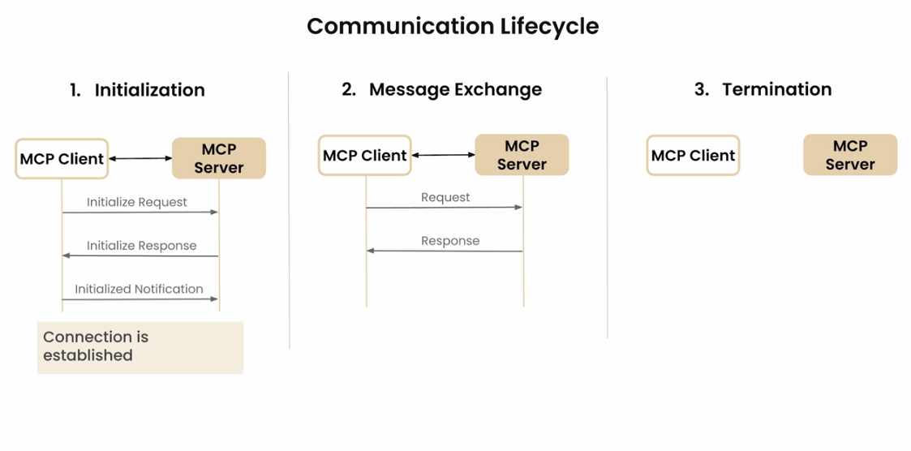
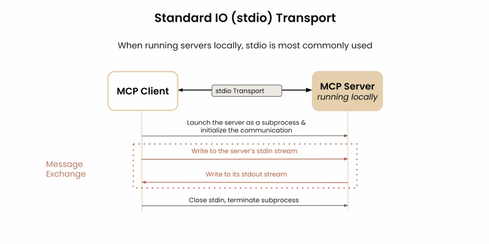

# Model Context Protocol

Creating a basic MCP client server local architecture project

## Setup

1. Install [uv](https://github.com/astral-sh/uv):

   ```bash
   pip install uv
   ```

2. Initialize your environment:

   ```bash
   uv init
   ```

3. Install dependencies:

   ```bash
   uv add -r requirements.txt
   # or
   uv pip install -r requirements.txt
   ```

## MCP Architecture

- **Servers:**

  - `research_server.py`
  - `dummy_server.py`  
    These files define MCP servers with their respective tools.

- **Clients:**
  - `agent_anthropic.py`
  - `agent_openai.py`  
    These files are MCP clients.

## Usage

- **Preview MCP Inspector:**

  ```bash
  npx @modelcontextprotocol/inspector uv run <server-file-name>
  ```

- **Run MCP Client:**

  ```bash
  uv run <client-file-name>
  ```

Replace `<server-file-name>` or `<client-file-name>` with the appropriate Python file.

### MCP Architecture Diagrams

For introductory understanding read `model-context-protocol.pdf`.

Below are diagrams illustrating the Model Context Protocol architecture ([DeepLearning.AI](https://learn.deeplearning.ai/courses/mcp-build-rich-context-ai-apps-with-anthropic/lesson/fkbhh/introduction)):







